# UNI MARE BY NGUYEN THE ANH

# Giới thiệu game

UNI MARE là tựa game bắn súng top-down. Lấy bối cảnh cuộc chiến giữa con người và những quái vật nightmare ngoài vũ trụ có mục tiêu thôn tính mặt trăng. Bạn được phân công bảo vệ 1 khu vực của mặt trăng trước ý định lăm le của bọn quái vật night mare. Hãy cố gắng hết sức sống sót và tiêu diệt trùm cuối để hoàn thành nhiệm vụ.  

- [0. Cách tải game](#0-cách-tải-game)
    * [a. Cách 1: Không bao gồm code.](#a-cách-1-không-bao-gồm-code)
    * [b. Cách 2: Bao gồm code và có thể biên dịch.](#b-cách-2-bao-gồm-code-và-có-thể-biên-dịch)
- [1. Bắt đầu game](#1bắt-đầu-game)
- [2. Các thành phần trong game:](#2-các-thành-phần-trong-game)
    * [a. Các vật cản và đồ rơi.](#a-các-vật-cản-và-đồ-rơi)
    * [b. Game UI](#b-game-ui)
- [3. Cách chơi](#3-cách-chơi)
    * [a. Các loại vũ khí](#a-các-loại-vũ-khí)
    * [b. Các loại nightmare](#bcác-loại-nightmare)
- [4. Chiến thắng và thất bại](#4-chiến-thắng-và-thất-bại)
- [Về đồ họa của game:](#về-đồ-họa-của-game)
- [Về source code game](#về-source-code-game)

# 0. Cách tải game

## a. Cách 1: Không bao gồm code.

Tải game (được nén thành .zip) tại link
sau: https://github.com/nmhienbn/PVZ-Kaito-NMH-Edition/releases/tag/published 
Cách này tiết kiệm bộ nhớ và thời gian tải đi rất nhiều (khoảng 103MB). 
Giải nén game vào một thư mục và bật pvz.exe lên và chơi. 

## b. Cách 2: Bao gồm code và có thể biên dịch.

**Bước 1:** Clone repo này về (Khoảng 800 MB - do có cả lịch sử các phiên bản).  
Hoặc Chọn Code -> Download Zip (Khoảng 90MB)

- Tất cả code đều nằm trong thư mục src. 
- Có thể nhảy đến bước 5 để chơi luôn.

**Bước 2:** Cài mingw. Ở đây tôi cài đặt phiên bản MinGW-W64
GCC-8.1.0 [x86_64-posix-seh](https://sourceforge.net/projects/mingw-w64/files/Toolchains%20targetting%20Win64/Personal%20Builds/mingw-builds/8.1.0/threads-posix/seh/x86_64-8.1.0-release-posix-seh-rt_v6-rev0.7z/download). 
Một số chú ý:  

- Nếu sử dụng trình biên dịch khác thì phải dịch lại icon: vào thư mục icon rồi dùng
  lệnh `windres main.rc -O coff main.res` trong cmd. 
- Phải xóa ba dll của c++ trong thư mục chứa pvz.exe: `libgcc_s_seh-1.dll`, `libstdc++-6.dll`, `libwinpthread-1.dll`. Ba
  dll này chỉ dành cho người chơi không cài sẵn c++ trong máy.

**Bước 3:** Cài GNU make

**Bước 4:** Mở cmd trong thư mục chứa Makefile và gõ lệnh make.

**Bước 5:** Bật pvz.exe và chơi

# 1. Bắt đầu game

Đầu tiên xuất hiện phần menu chính của game, bạn có thể click chuột vào ô "Start" để bắt đầu game. Nếu không, lựa chọn quit và xác nhận để thoát. 

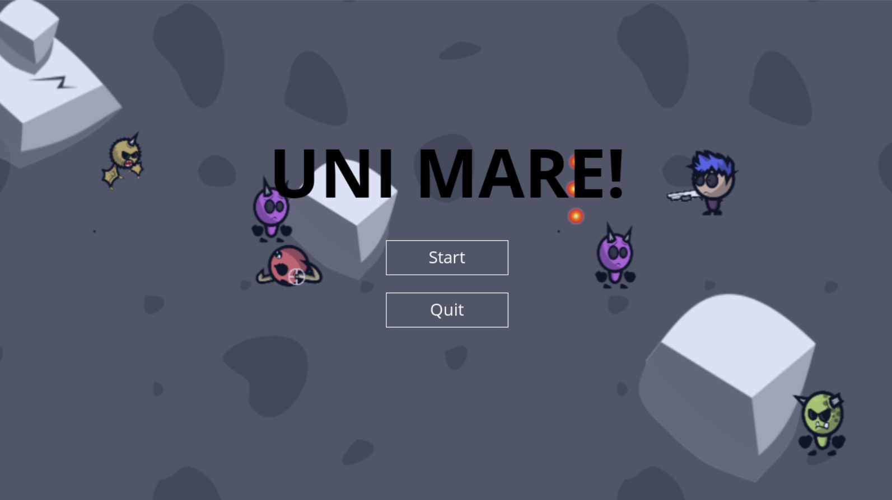

Khi bắt đầu game người chơi sẽ ngay lập tức nhận được vũ khí khởi đầu - Lightsaber

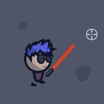

# 2. Các thành phần trong game:

## a. Các vật cản và đồ rơi.
-    Rock (đá)
      : là địa hình của mặt trăng, chúng là vật cản duy nhất bạn có thể tận dụng để tiêu diệt bọn nightmare vì rock sẽ ngăn không cho người chơi và nightmare di chuyển qua (trừ nightmare type2).
     Dropped Weapon (vũ khí rơi)
      : là vũ khí rơi ra khi bạn tiêu diệt các nightmare có thể nhặt lên sử dụng, tùy vào từng cấp độ, vũ khí rơi ra sẽ có nhiều loại và cấp độ khác nhau.
## b. Game UI
-    Máu và thanh máu
      : nằm ở góc dưới bên trái của màn hình, bạn chỉ có 1 lượng máu nhất định khi bắt đầu nhiệm vụ. Chú ý vào đây bạn sẽ biết được số lượng máu còn lại mình đang có.
-    Thông tin vũ khí
      : nằm ở góc dưới bên phải của màn hình, hiển thị những thông tin bạn cần biết như :số lượng đạn/số đạn tối đa,vũ khí hiện tại bạn đang cầm, cấp độ của vũ khí.
-    Điểm số 
      : nằm ở góc trên bên phải của màn hình là điểm số duy trì của bạn(Score), càng tiêu diệt nhiều nightmare, sống sót càng lâu điểm số của bạn sẽ càng cao
-    Thông tin  cấp độ
      : nằm ỏ góc trên bên trái của màn dình, hiển thị thông tin hiện tại của cấp độ: cấp độ bạn đang ở(current level),
      số nightmare bạn đã giết được ở level này/tổng số nightmare bạn cần giết để đến cấp độ tiếp theo

- Bố cục game cơ bản:

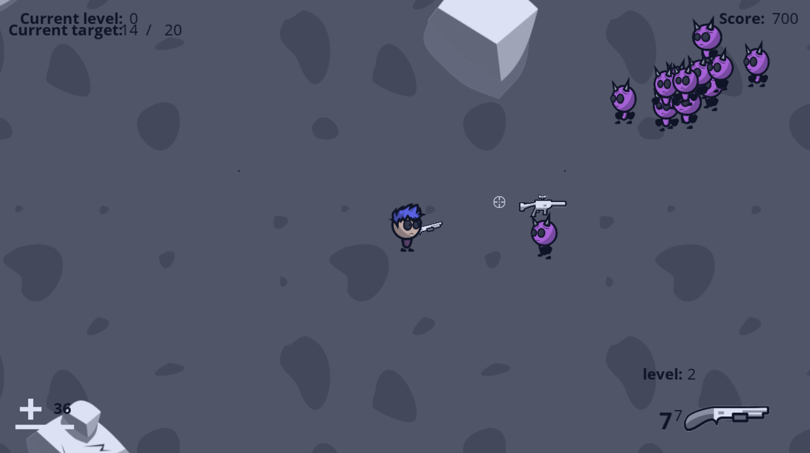

 

# 3. Cách chơi
Sử dụng các phím di chuyển xung quanh WASD để di chuyển xung quanh. 
Click chuột phải để thực hiện tấn công vào vị trí chỉ định 
Có thể nhặt được những vũ khí đã rơi từ nightmare bằng cách nhấn phím F 
Có thể thay đổi vũ khí thành vũ khí khác sau khi đã nhặt đủ 2 vũ khí bằng cách lăn chuột 
Khi muốn dừng game lại nhấn phím ESC và lựa chọn hành động bạn mong muốn: Resume, Retry, Quit bằng cách click chuột vào 
Giữ khoảng cách với bọn nightmare và sống sót. 

## a. Các loại vũ khí.

Có 4 loại vũ khí, lần lượt theo thứ tự có thể nhặt được từ bọn quái vật là:

|                                                                             | Tên vũ khí	     | Khả năng                                                                                                                 |
|-----------------------------------------------------------------------------|--------------|------------------------------------------------------------------------------------------------------------------------------|
| 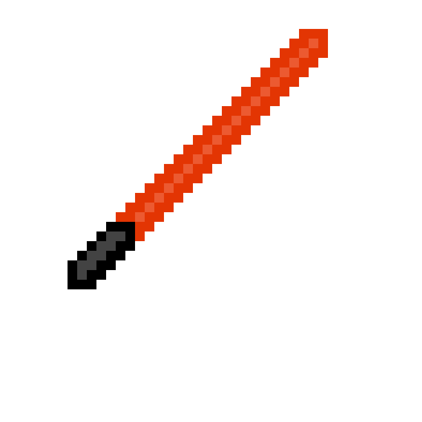  | LightSaber	  | Sát thương vừa, tốc độ tấn công vừa phải, không tiêu tốn đạn dược.                                                                                              |
| 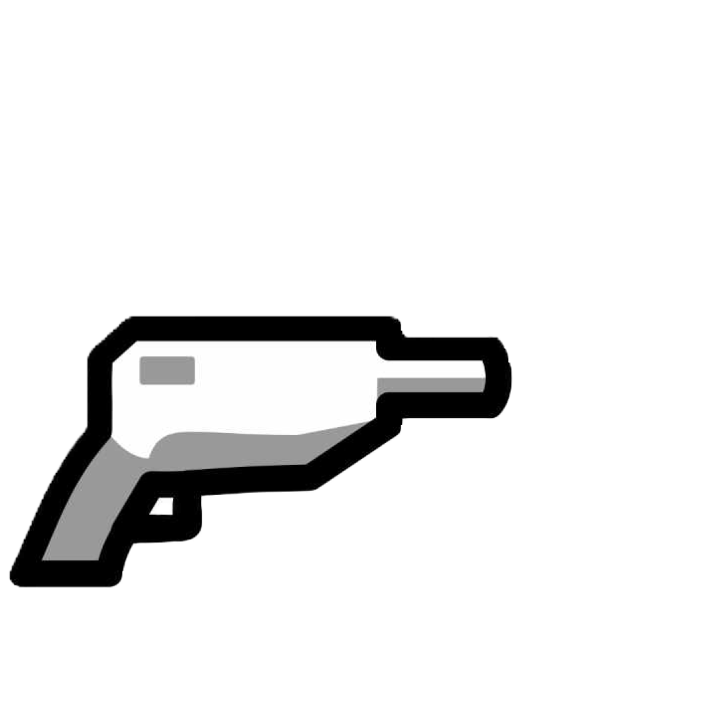    | Pistol	   | Sát thương vừa phải, tốc độ bắn chậm, băng đạn tối đa vừa phải.                                                                                               |
| 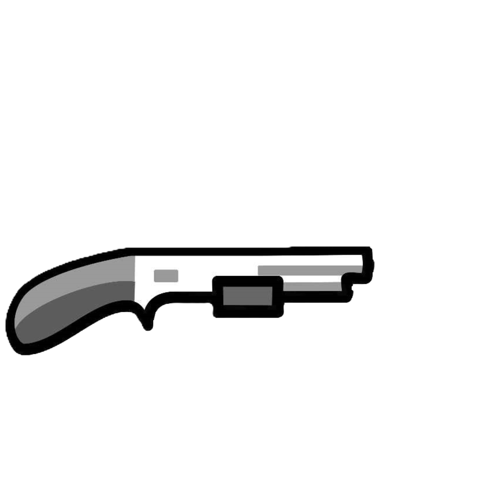          | Shotgun	    | Sát thương cao, tốc độ bắn chậm, băng đạn tối đa ít.                                                                   |
| 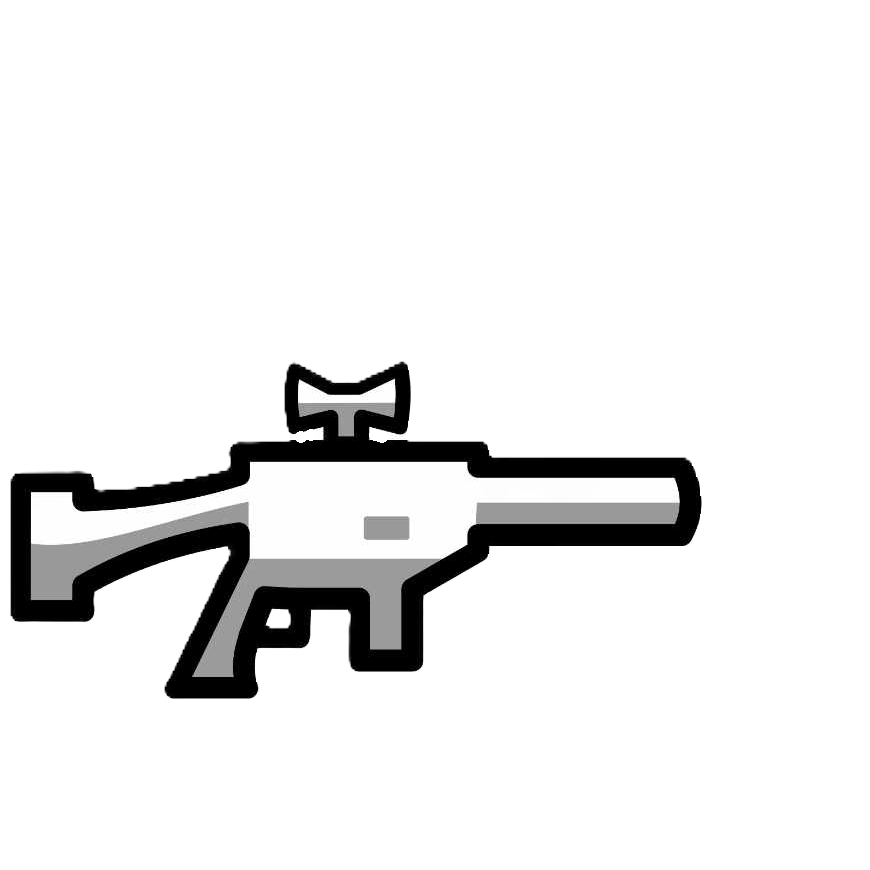        | Rifle	    | Sát thương vừa phải, tốc độ bắn nhanh, băng đạn tối đa nhiều. |

## b. Các loại nightmare

- Có 4 loại nightmare:

|                                         | Tên nightmare 	       | Khả
năng                                                                                        |
|-----------------------------------------|--------------------|--------------------------------------------------------------------------------------------------|
| 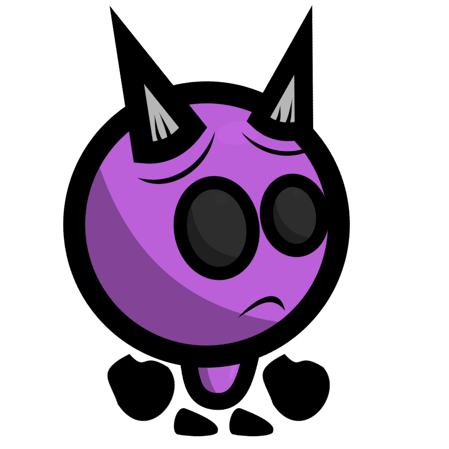 | Type 0	  | Máu cơ bản cao, sát thương thấp, tốc độ di chuyển chậm.                                                                            |
| 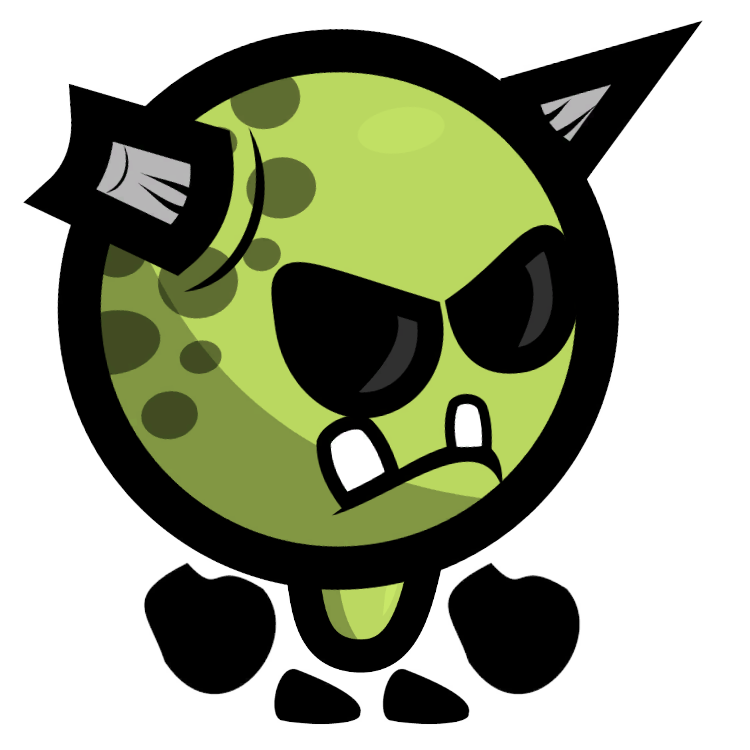  | Type 1	       | Phiên bản nâng cấp của type 0 xuất hiện từ level 1.                                                  |
| 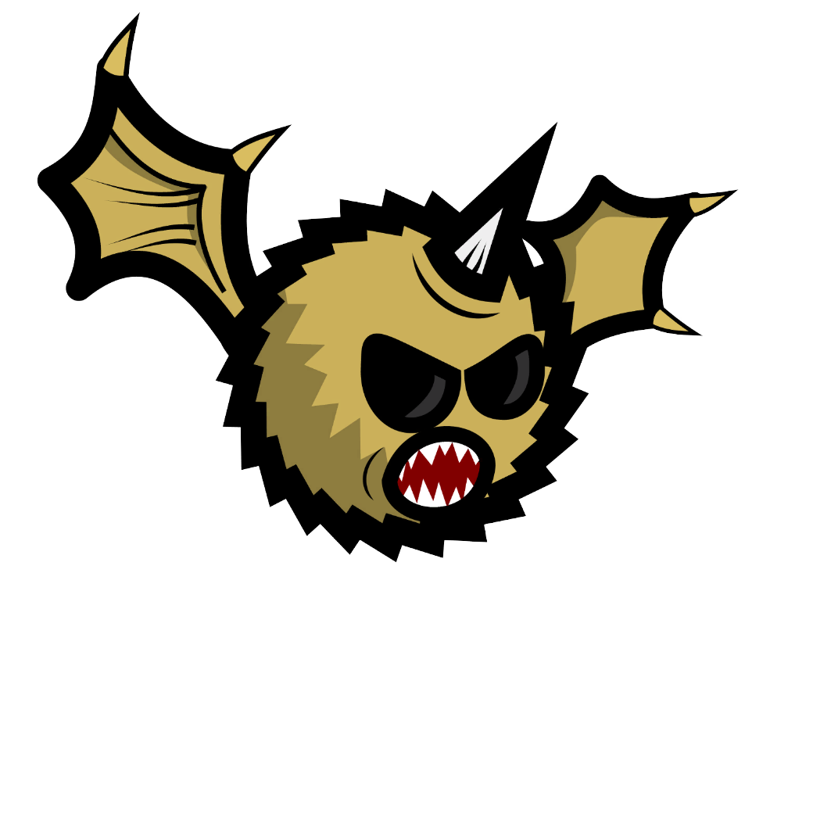  | Type 2	   | Tốc độ di chuyển nhanh, có khả năng bay qua các vật cản, sát thương vừa phải, máu thấp, xuất hiện từ level 2, là trùm cuối của nhiệm vụ này.                                     |
| 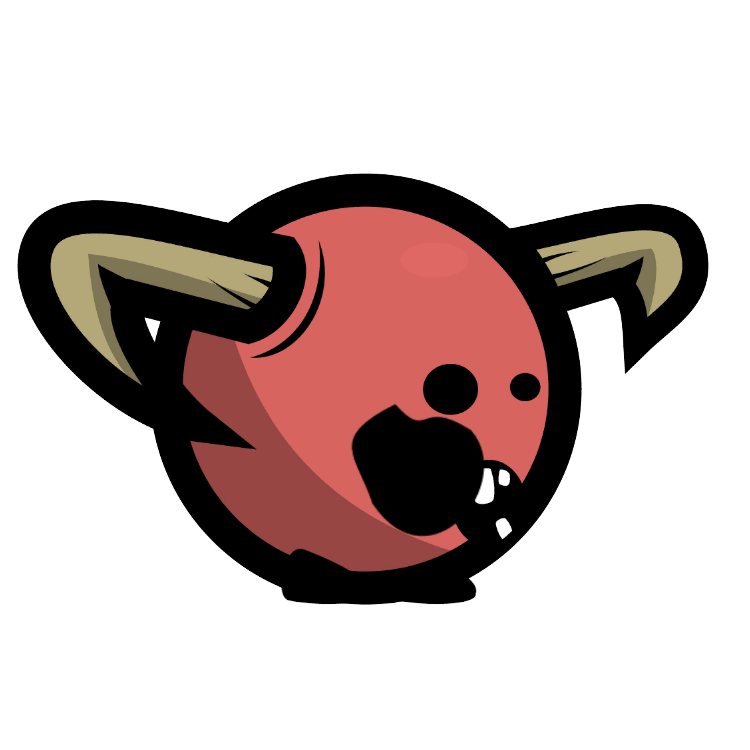 | Type 3	 | Tốc độ di chuyển cực nhanh, máu vừa phải,gây sát thương và tự hủy khi chạm vào người chơi, xuất hiện từ level 3.                                                                   |
# 4. Chiến thắng và thất bại

- Bạn sẽ chiến thắng nếu đạt đến level 4 và tiêu diệt trùm cuối trong thời gian chỉ định .

- Bạn sẽ thất bại nếu hết máu hoặc không tiêu diệt được trùm cuối trong thời gian chỉ định.

---

### Về đồ họa của game:

[[Cách làm hiệu ứng từng cây, zombie trong game]](about_graphics.md)

### Về source code game:

- Folder draw:
    * khởi tạo window và renderer
    * chứa tất cả các ảnh trong game (được đánh số)
    * chứa hầu hết các câu lệnh của SDL2, SDL2_image, SDL2_ttf, sử dụng để vẽ load ảnh, chữ và vẽ lên renderer, window.
- Folder elements: Chứa tất cả các thành phần của game:
    * bullets: các loại đạn
    * button: các loại nút trong game (có thể nhấn được hoặc không)
    * Map: chứa hàm random và khởi tạo bảng 5 x 9 cho màn chơi.
    * mower: máy cắt cỏ (Cán zombie)
    * plants: chứa tất cả các loại plant (được kế thừa từ class Plants)
    * zombies: chứa tất cả các loại zombies (được kế thừa từ class Zombie)
    * elements: gom lại các loại plants và zombies.
    * elements_actions:
        + chứa hầu hết các tương tác giữa các thành phần game với nhau, và với màn chơi.
        + tạo ngẫu nhiên zombie
        + cập nhật tất cả các thay đổi của game theo từng khung hình
- Folder events: Xử lý các sự kiện trong game (sự kiện chuột, bàn phím)
    * in_game: xử lý các sự kiện khi đang trong một màn chơi
        + credit: phần giới thiệu các loại zombie & ready-set-plant
        + game: tất cả các sự kiện trong một màn chơi
        + lose: xử lý khi thua
        + main_menu: xử lý khi người chơi muốn trở lại phần chọn màn chơi
        + pause_menu: xử lý khi người chơi dừng game (nút dừng hoặc click ra ngoài game)
        + restart_menu: xử lý khi người chơi muốn chơi lại màn chơi
        + turbo: xử lý nút tăng tốc game
        + volume: xử lý nút điều chỉnh âm lượng nhạc nền và hiệu ứng.
        + win: xử lý khi chiến thắng trò chơi.
    * mouse_cursor: xử lý con trỏ chuột
    * out_game: xử lý các sự kiện ngoài màn chơi
        + choose_level: xử lý chọn màn chơi
        + quit_menu: xử lý nút quit game: tắt game
        + reset_level: xử lý nút reset level: xóa tiến trình chơi
        + start_game: xử lý nút "Click to start" để bắt đầu vào game.
        + unlock_plant: xử lý mở khóa plant mới.
- Folder level: xử lý phần lấy dữ liệu ván chơi.
- Folder music: xử lý phần âm thanh của game - SDL2_mixer
- Folder player: xử lý phần dữ liệu người chơi. Bao gồm việc lấy và thay đổi tên, tiến trình.
- game_stats.hpp: chứa tất cả thông số game
- game.hpp và game.cpp: hàm main() của trò chơi.