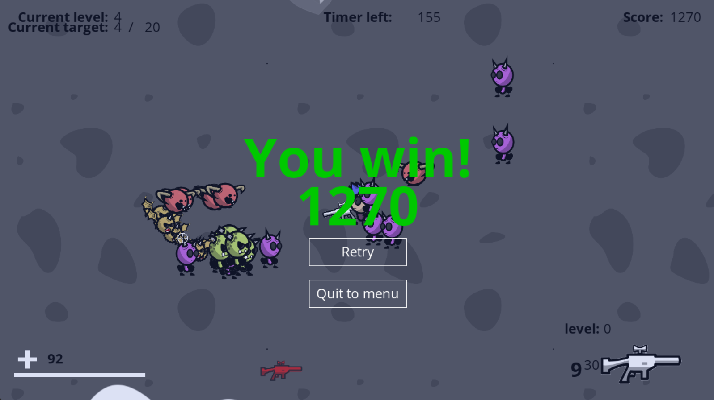
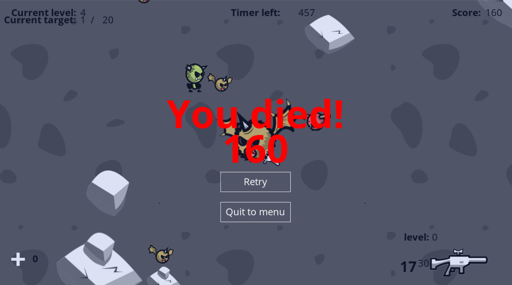

# UNI MARE BY NGUYEN THE ANH

- Game walkthrough: https://youtu.be/9hTzD6XTmV4?feature=shared

# Giới thiệu game

UNI MARE là tựa game bắn súng top-down. Lấy bối cảnh cuộc chiến giữa con người và những quái vật nightmare ngoài vũ trụ có mục tiêu thôn tính mặt trăng. Bạn được phân công bảo vệ 1 khu vực của mặt trăng trước ý định lăm le của bọn quái vật night mare. Hãy cố gắng hết sức sống sót và tiêu diệt trùm cuối để hoàn thành nhiệm vụ.  

- [0. Cách tải game](#0-cách-tải-game)
- [1. Bắt đầu game](#1bắt-đầu-game)
- [2. Các thành phần trong game:](#2-các-thành-phần-trong-game)
    * [a. Các vật cản và đồ rơi.](#a-các-vật-cản-và-đồ-rơi)
    * [b. Game UI](#b-game-ui)
- [3. Cách chơi](#3-cách-chơi)
    * [a. Các loại vũ khí](#a-các-loại-vũ-khí)
    * [b. Các loại nightmare](#bcác-loại-nightmare)
- [4. Chiến thắng và thất bại](#4-chiến-thắng-và-thất-bại)
- [Về cấu trúc của game:](#về-cấu-trúc-của-game)
- [Về source code game](#về-source-code-game)
- [Nguồn và cảm hứng](#nguồn-và-cảm-hứng)

# 0. Cách tải game
**Bước 1:** Clone repo.  
Hoặc Chọn Code -> Download Zip 
- Tất cả code đều nằm trong thư mục src. 
- Có thể nhảy đến bước 5 để chơi luôn.

**Bước 2:** Cài mingw. Ở đây tôi cài đặt phiên bản MinGW-W64
GCC-8.1.0 [x86_64-posix-seh](https://sourceforge.net/projects/mingw-w64/files/Toolchains%20targetting%20Win64/Personal%20Builds/mingw-builds/8.1.0/threads-posix/seh/x86_64-8.1.0-release-posix-seh-rt_v6-rev0.7z/download). 
Một số chú ý:  

- Nếu sử dụng trình biên dịch khác thì phải dịch lại icon: vào thư mục icon rồi dùng
  lệnh `windres main.rc -O coff main.res` trong cmd. 
- Phải di chuyển dll của c++ trong thư mục Important ra ngoài thư mục chứa Unimare.exe: `libgcc_s_seh-1.dll`, `libstdc++-6.dll`, `libwinpthread-1.dll`. Ba
  dll này chỉ dành cho người chơi không cài sẵn c++ trong máy.

**Bước 3:** Cài GNU make

**Bước 4:** Mở cmd trong thư mục chứa Makefile và gõ lệnh make.

**Bước 5:** Bật Unimare.exe và chơi

# 1. Bắt đầu game

Đầu tiên xuất hiện phần menu chính của game, bạn có thể click chuột vào ô "Start" để bắt đầu game. Nếu không, lựa chọn quit và xác nhận để thoát. 

Khi bắt đầu game người chơi sẽ ngay lập tức nhận được vũ khí khởi đầu - Lightsaber

# 2. Các thành phần trong game:

## a. Các vật cản và đồ rơi.
-    Rock (đá)
      : là địa hình của mặt trăng, chúng là vật cản duy nhất bạn có thể tận dụng để tiêu diệt bọn nightmare vì rock sẽ ngăn không cho người chơi và nightmare di chuyển qua (trừ nightmare type2). 
     Dropped Weapon (vũ khí rơi)
      : là vũ khí rơi ra khi bạn tiêu diệt các nightmare có thể nhặt lên sử dụng, tùy vào từng cấp độ, vũ khí rơi ra sẽ có nhiều loại và cấp độ khác nhau.
## b. Game UI
-    Máu và thanh máu
      : nằm ở góc dưới bên trái của màn hình, bạn chỉ có 1 lượng máu nhất định khi bắt đầu nhiệm vụ. Chú ý vào đây bạn sẽ biết được số lượng máu còn lại mình đang có.
-    Thông tin vũ khí
      : nằm ở góc dưới bên phải của màn hình, hiển thị những thông tin bạn cần biết như :số lượng đạn/số đạn tối đa,vũ khí hiện tại bạn đang cầm, cấp độ của vũ khí.
-    Điểm số 
      : nằm ở góc trên bên phải của màn hình là điểm số duy trì của bạn(Score), càng tiêu diệt nhiều nightmare, sống sót càng lâu điểm số của bạn sẽ càng cao
-    Thông tin  cấp độ
      : nằm ỏ góc trên bên trái của màn dình, hiển thị thông tin hiện tại của cấp độ: cấp độ bạn đang ở(current level),
      số nightmare bạn đã giết được ở level này/tổng số nightmare bạn cần giết để đến cấp độ tiếp theo

- Bố cục game cơ bản:

 

# 3. Cách chơi
Sử dụng các phím di chuyển xung quanh WASD để di chuyển xung quanh. 
Click chuột phải để thực hiện tấn công vào vị trí chỉ định 
Có thể nhặt được những vũ khí đã rơi từ nightmare bằng cách nhấn phím F 
Có thể thay đổi vũ khí thành vũ khí khác sau khi đã nhặt đủ 2 vũ khí bằng cách lăn chuột 
Khi muốn dừng game lại nhấn phím ESC và lựa chọn hành động bạn mong muốn: Resume, Retry, Quit bằng cách click chuột vào 
Càng tiêu diệt nhiều quái bạn sẽ càng đến cấp độ cao hơn, cấp độ càng cao tỉ lệ rơi vũ khí mạnh càng cao, nhưng độ khó cũng tăng lên  
Giữ khoảng cách với bọn nightmare và sống sót. 

## a. Các loại vũ khí.

Có 4 loại vũ khí, lần lượt theo thứ tự có thể nhặt được từ bọn quái vật là:

|                                                                             | Tên vũ khí	     | Khả năng                                                                                                                 |
|-----------------------------------------------------------------------------|--------------|------------------------------------------------------------------------------------------------------------------------------|
|   | LightSaber	  | Sát thương vừa, tốc độ tấn công vừa phải, không tiêu tốn đạn dược.                                                                                              |
|     | Pistol	   | Sát thương vừa phải, tốc độ bắn chậm, băng đạn tối đa vừa phải.                                                                                               |
|           | Shotgun	    | Sát thương cao, tốc độ bắn chậm, băng đạn tối đa ít.                                                                   |
|         | Rifle	    | Sát thương vừa phải, tốc độ bắn nhanh, băng đạn tối đa nhiều. |

## b. Các loại nightmare

- Có 4 loại nightmare:

|                                                                             | Tên nightmare | Khả năng                                                                                                                |
|-----------------------------------------------------------------------------|---------------|-------------------------------------------------------------------------------------------------------------------------|
|  | Type 0        | Máu cơ bản cao, sát thương thấp, tốc độ di chuyển chậm.                                                                 |
|   | Type 1         | Phiên bản nâng cấp của Type 0 xuất hiện từ level 1.                                                                      |
|   | Type 2         | Tốc độ di chuyển nhanh, có khả năng bay qua các vật cản, sát thương vừa phải, máu thấp, xuất hiện từ level 2, là trùm cuối của nhiệm vụ này. |
|  | Type 3         | Tốc độ di chuyển cực nhanh, máu vừa phải, gây sát thương và tự hủy khi chạm vào người chơi, xuất hiện từ level 3.     |

# 4. Chiến thắng và thất bại

- Bạn sẽ chiến thắng nếu đạt đến level 4 và tiêu diệt trùm cuối trong thời gian chỉ định .

- Bạn sẽ thất bại nếu hết máu hoặc không tiêu diệt được trùm cuối trong thời gian chỉ định.

---

### Về cấu trúc của game:
-   Các vật thể trong game được render bằng cách sử dụng SDL_Texture, hoạt ảnh thay đổi bằng cách thay đổi vị trí render  trên spritesheet, vị trí của các vật thể đều được tính dựa trên SDL_Rect Camera. Camera được render dựa vào trung tâm của của người chơi
-   Với những đa vật thể như đạn, kẻ thù, đá, súng rơi, chúng được lưu trữ bên trong các vector kiểu cấu trúc GameObject hoặc kiểu cấu trúc kế thừa của GameObject như Weapon, Enemy.
-   Với những vật thể như người chơi , vũ khí, kẻ thù trạng thái của chúng được đặt bằng kiểu trạng thái(States).
-   Âm thanh của game được xử lý bởi một class audio, với mỗi lần gọi một hàm riêng biệt sẽ set chức năng thành play/pause của âm thanh mà hàm gọi đến

### Về source code game:

- Global.h & Global.cpp:
    * chứa những biến toàn cục trong game
    * chứa các hàm tính khoảng cách random số nguyên, số thực.
    * StateStruct máy trạng thái, sử dụng con trỏ để chuyển đổi giữa các trạng thái như Game,Menu,Pause,EnGame bằng cách trỏ đến các hàm này.
- Graphics.h & Graphics.cpp: Liên quan đến việc xử lý texture và render:
- GameObject.h & GameObject.cpp: Tạo cấu trúc cơ bản của vật thể và các hàm liên quan.
    * Player.h & Player.cpp: cấu trúc cơ bản của nhân vật.
    * Enemy.h & Enemy.cpp: cấu trúc cơ bản của kẻ thù.
    * Weapon.h & Weapon.cpp: Cấu trúc cơ bản của vũ khí và đạn súng.
- Button.h & Button.cpp: Cấu trúc của các nút bấm trong game và xử lý input từ chuột.
- Audio.h & Audio.cpp: Cấu trúc âm thanh cơ bản của game.
- Main.cpp: Chứa hàm main() của game và các hàm xung quanh xử lý game.

#### Nguồn và cảm hứng.
-https://rgsdev.itch.io/ (sử dụng hình ảnh nhân vật, vũ khí và hình nền)
-https://pixabay.com/vi/sound-effects/ (sử dụng âm thanh) 
-https://fonts.google.com/specimen/Open+Sans (sử dụng phông chữ)
